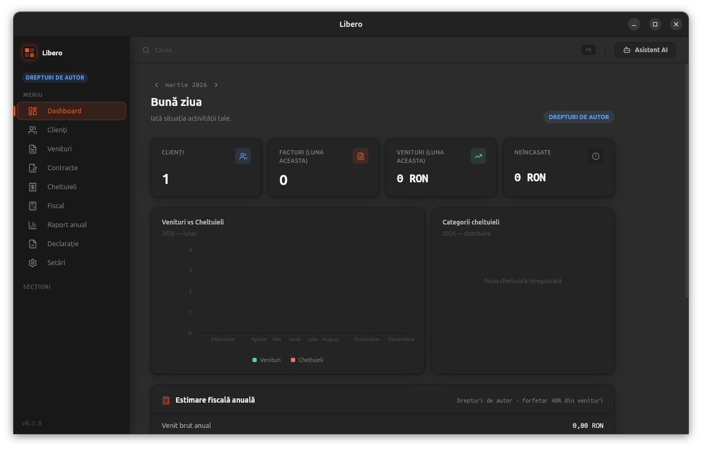
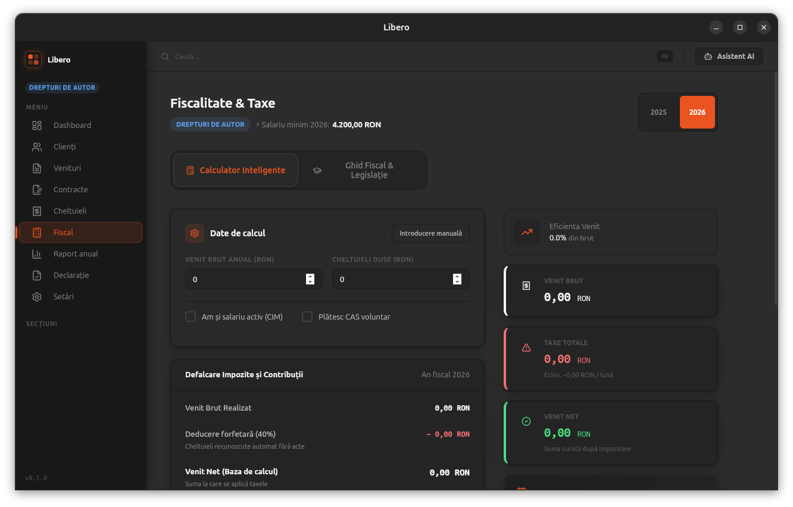
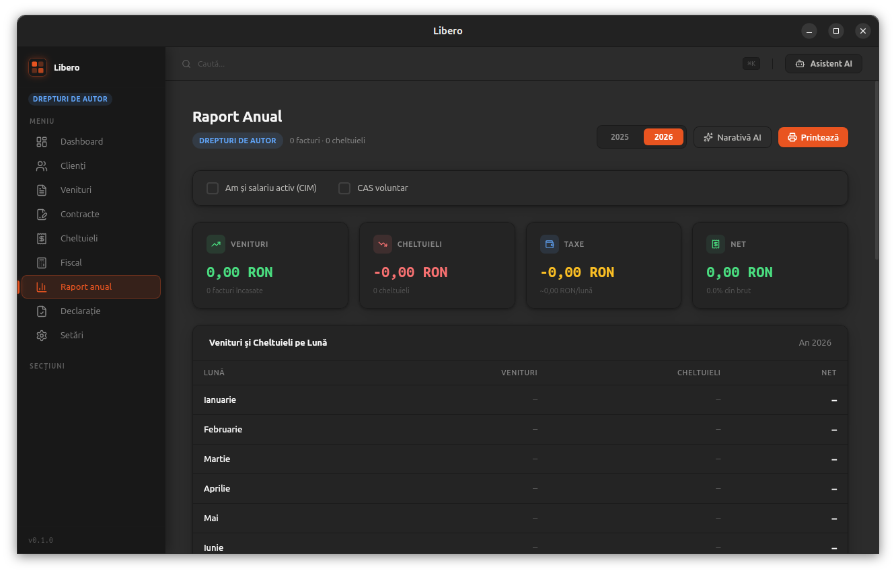
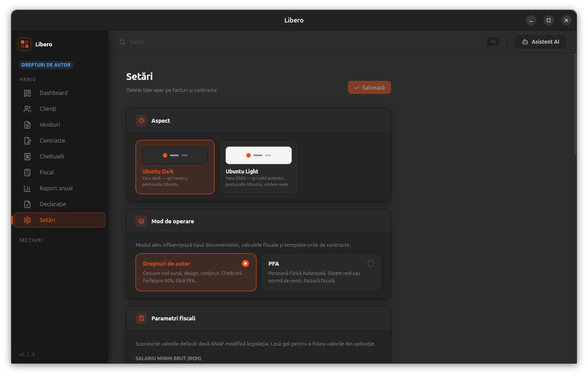

# PFA Manager

Aplicație desktop pentru gestionarea activității de freelancing în România — facturi, contracte, cheltuieli și calcule fiscale pentru DDA și PFA.

## Funcționalități

- **Facturi** — emitere, urmărire status (neplătit/plătit/anulat), categorii, semnare
- **Contracte** — template-uri legale (cesiune drepturi de autor, cesiune cu abonament, prestări servicii), editor rich-text integrat
- **Clienți** — registru cu CIF, adresă, persoană de contact
- **Cheltuieli** — înregistrare cheltuieli deductibile cu categorii (PFA)
- **Fiscal** — calcul automat CASS, CAS, impozit pe venit, deducere forfetară (DDA)
- **Raport anual** — sinteză financiară cu grafice și narativ generat AI
- **Declarație D100** — ghid calcul impozit semestrial
- **Asistent AI** — analiză contracte PDF, extragere date bon fiscal, monitorizare legislație (Gemini)

## Moduri de operare

| Mod | Descriere | Deducere |
|-----|-----------|----------|
| **DDA** | Drepturi de Autor | 40% forfetară din venit brut |
| **PFA** | Persoană Fizică Autorizată | Cheltuieli reale sau normă de venit |

Modul se configurează din **Setări** și influențează calculele fiscale, categoriile de cheltuieli și template-urile de contracte.

## Capturi de ecran

| Dashboard | Fiscal |
|-----------|--------|
|  |  |

| Raport anual | Setări |
|--------------|--------|
|  |  |

## Tehnologii

- **Frontend:** React 19, TypeScript, Vite, React Router 7
- **Desktop:** Tauri 2 (Rust)
- **Baza de date:** SQLite (local, `pfa.db`)
- **Editor contracte:** Lexical
- **Grafice:** Recharts
- **AI:** Google Gemini API

## Cerințe

- [Node.js](https://nodejs.org/) ≥ 18
- [pnpm](https://pnpm.io/)
- [Rust](https://rustup.rs/) (toolchain stable)
- Dependențe sistem pentru Tauri: [ghid oficial](https://tauri.app/start/prerequisites/)

## Dezvoltare

```bash
pnpm install
pnpm tauri dev
```

## Build

```bash
pnpm tauri build
```

Executabilul se generează în `src-tauri/target/release/`.

## Descărcare

Descarcă ultima versiune de pe pagina [Releases](https://github.com/skorpionwap/pfa-manager/releases).

| Platformă | Fișier |
|-----------|--------|
| **Windows** | `PFA-Manager_1.0.0_x64-setup.exe` sau `.msi` |
| **Linux** | `pfa-manager_1.0.0_amd64.deb` sau `.AppImage` |
| **macOS** | `PFA Manager.app` sau `.dmg` |

### Creare release nou

```bash
git tag v1.0.0
git push origin v1.0.0
```

GitHub Actions va build-ui automat pentru toate platformele și va crea un draft release.

## Configurare

La prima rulare, mergi în **Setări** pentru a configura:

- Datele personale (nume, CIF, adresă) — folosite în template-urile de contracte
- Seria și numărul de start al facturilor
- Cheia API Gemini (pentru funcționalitățile AI)
- Modul de operare (DDA / PFA)
- Valorile fiscale pe an (salariu minim, cote contributii) dacă diferă de valorile implicite

## Licență

MIT © 2026 Mircea Gabriel — vezi [LICENSE](./LICENSE)
